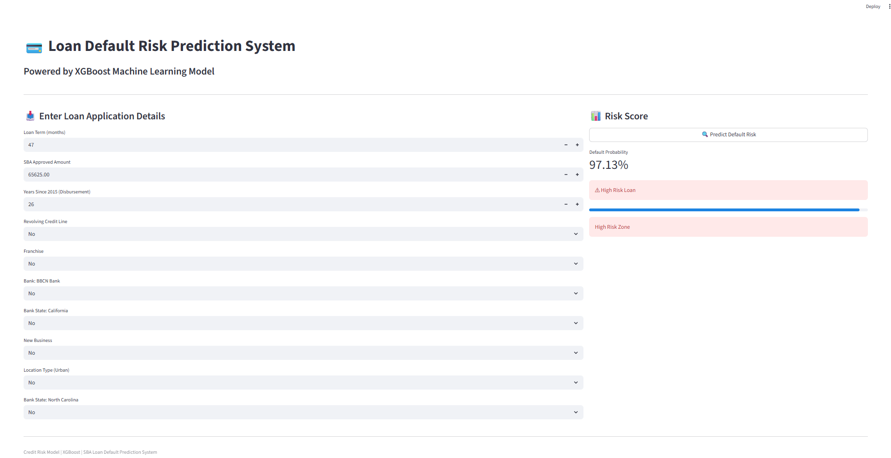

# 💳 SBA Loan Default Prediction System  
### (Logistic Regression (Baseline) • Random Forest (Benchmark)• XGBoost • Voting • Stacking)

---

## 📌 Project Overview

This project presents a complete machine learning pipeline for predicting loan defaults using the **U.S. Small Business Administration (SBA)** dataset.

The objective is to build a robust and interpretable credit risk model capable of identifying high-risk loans using both **individual models** and **ensemble learning techniques**.

The project evaluates multiple machine learning approaches and applies **hyperparameter tuning** to optimize performance.

---

## 🎯 Problem Statement

Loan default prediction is a core challenge in financial risk management. Traditional scoring methods often fail to capture complex nonlinear patterns in borrower behavior.

This project aims to:
- Predict whether a loan will default or not
- Compare multiple machine learning models
- Improve predictive performance using ensemble learning
- Optimize models using hyperparameter tuning

---

## 📊 Dataset

The dataset is sourced from the **Small Business Administration (SBA)** and includes information about:
- Loan amounts and terms
- Business characteristics
- Borrower and financial attributes
- Loan outcome (default / non-default)

### Target Variable:
- **CHGOFF** → Indicates loan default status

---

## ⚙️ Methodology

### 1. Data Preprocessing
- Handling missing values
- Encoding categorical variables
- Feature selection
- Removal of data leakage variables

---

### 2. Handling Class Imbalance
- Applied **SMOTE (Synthetic Minority Oversampling Technique)** to balance the dataset and improve model learning on minority class (defaults)

---

Got it — let’s fix that section properly and make it **technically correct, clean, and consistent with what you actually did**.

You want:

* Baseline benchmark clearly defined
* XGBoost treated as the main strong learner
* Voting + Stacking correctly framed as ensemble techniques
* No confusion between “baseline” and “best model”

Here is the **corrected and professional version**:

---

### 3. Model Development

### i. Baseline Benchmark Model

A **Logistic Regression model** was used as the baseline benchmark.

This model provides a simple linear reference point for evaluating performance improvements from more advanced machine learning techniques.

---

### ii. Individual Machine Learning Models

Two tree-based models were trained to capture non-linear relationships in the data:

* **Random Forest Classifier**
* **XGBoost Classifier**

Among these, **XGBoost** demonstrated the strongest predictive performance after hyperparameter tuning and was selected as the primary high-performance model.

---

### iii. Hyperparameter Tuning

The XGBoost model was optimized using **RandomizedSearchCV with cross-validation**, improving its ability to generalize and handle complex feature interactions.

Tuned parameters included:

* max_depth
* learning_rate
* n_estimators
* subsample
* colsample_bytree
* min_child_weight
* gamma

---

### iv. Ensemble Learning Methods

To further improve robustness and model stability, two ensemble techniques were implemented:

#### 🟢 Voting Classifier (Soft Voting)

Combines predictions from multiple base learners by averaging predicted probabilities, improving stability and reducing variance.

#### 🔵 Stacking Classifier

Uses a meta-model to learn from the outputs of base models (Logistic Regression, Random Forest, and XGBoost), allowing the model to capture higher-level patterns.

---

## 🧠 Final Model Selection

The **XGBoost model with tuned hyperparameters** was selected as the final model due to its superior balance between predictive power and stability.

---

## 📈 Model Performance

### 🏆 Final XGBoost Results

- **Accuracy:** 0.93  
- **ROC-AUC:** 0.973  
- **Recall (Default Class):** 0.90  
- **Precision (Default Class):** 0.76  
- **F1-Score:** 0.82  

---

### 📊 Model Comparison Summary

| Model                | Performance Insight |
|---------------------|---------------------|
| Logistic Regression | Baseline benchmark, lower predictive power |
| Random Forest       | Strong non-linear performance |
| XGBoost             | Best overall performance |
| Voting Classifier   | Improved stability through ensemble averaging |
| Stacking Classifier | Strong performance but slightly below XGBoost |

---

## 📊 Evaluation Visualizations

The following evaluation plots were generated:

- ROC Curve (model discrimination ability)
- Precision-Recall Curve (class imbalance performance)
- Confusion Matrix (prediction outcomes)
- Normalized Confusion Matrix (class-wise performance)
- Feature Importance (XGBoost interpretability)

📁 All visualizations are stored in the `/images` folder.

---

## 🧠 Key Insights

- XGBoost outperformed all individual and ensemble models in terms of ROC-AUC and recall balance
- Ensemble methods (Voting and Stacking) provided competitive but not superior performance
- Hyperparameter tuning significantly improved model generalization
- Recall of 0.90 ensures strong detection of loan defaults, which is critical in credit risk applications

---

## 🚀 Deployment

A **Streamlit web application** was developed to demonstrate real-time prediction of loan default risk.

### 🌐 Live Deployment Interface

Below is a snapshot of the deployed application:

### ⚙️ Features:
- User input interface for loan and borrower attributes  
- Real-time default probability prediction  
- Risk classification (High / Low risk)  
- Interactive visual feedback  
- Lightweight and browser-based deployment  

### 📌 Deployment Stack:
- Streamlit (Frontend + Backend)
- Pickled XGBoost model (`xgb_loan_model.pkl`)
- Python-based inference pipeline

---

## 🛠️ Tech Stack

- Python
- Pandas, NumPy
- Scikit-learn
- XGBoost
- Imbalanced-learn (SMOTE)
- Matplotlib, Seaborn
- Streamlit

---

## 📂 Project Structure
